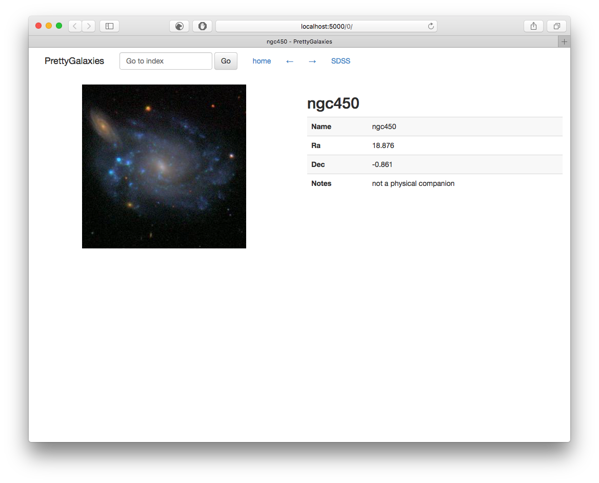

# ImageViewer

Do you have a bunch of images with meta information that you would like to go through (or share)?

This is a web-based image viewer for that.

It is a tiny [flask](http://flask.pocoo.org/) app, built with [bootstrap](http://getbootstrap.com/),
which will display images and their meta information from a table with pagination. It could be a starting point for a more complex application.

**WARNING:** This app was built to run locally for my own convenience and
to be shared with a small number of collaborators. In `app.py`, the entire table is
loaded into a global variable `table`. This can be problematic if the table is large,
and the app receives a lot of traffic, as it will load the data for every process.
You'll want to setup a proper database. See

- [this stackoverflow question](http://stackoverflow.com/questions/28141454/flask-using-a-global-variable-to-load-data-files-into-memory)
- flask documentation on databases


## Test out

You can either run in a new conda environment or use docker.

1. Create a new conda environment to install required packages locally:

```sh
git clone https://github.com/smoh/imageviewer
cd imageviewer
conda env create    # will create 'viewer' environment specified in environment.yml
source activate viewer
python app.py
```

2. Use [docker](https://www.docker.com/):
```sh
git clone https://github.com/smoh/imageviewer
cd imageviewer
docker-compose up --build
```

Once the app is running, point your browser to `localhost:5000`.
This will show images inside `example/images/` directory with the related information in `fakecatalog.csv`
like this:



Configure static file paths in `app.py` and modify templates in `templates/`
according to your needs. [Flask](http://flask.pocoo.org/) uses the [jinja](http://jinja.pocoo.org/) template engine.
